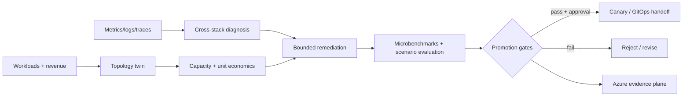

# AI Fabric Autopilot: Agentic AI Factory Revenue, GPU, Network and Hybrid Cloud Control Plane

## Artificial Intelligence, Generative AI, Cloud Computing, Microsoft Azure, AWS, Google Cloud, Apache CloudStack, VMware, Proxmox, Virtualization, Docker, Kubernetes, DevOps, Network Automation, Ansible, Chef, Puppet, Infrastructure as Code and Compliance as Code

**Convert AI-factory workload demand, topology and cross-stack telemetry into a measurable architecture decision, capacity economics, bounded remediation and production-readiness receipt.**

This project connects agentic AI, GPU infrastructure, high-performance networking, observability, cloud architecture, cybersecurity and IaC-to-compliance evidence without claiming access to hardware that was not used.

> Hardware-independent lane: the current demonstration uses deterministic synthetic DCGM/NCCL/NVLink/InfiniBand/RoCE/NIM-shaped fixtures. NVIDIA collectors and model providers are contracts until an authorized partner run produces retained evidence.



## Working vertical slice

- validates a 256-GPU commercial AI-factory intent;
- compares Ethernet, RoCE and InfiniBand reference topologies;
- diagnoses NCCL regression, PFC/ECN congestion, storage starvation, NVLink degradation and GPU XID errors;
- calculates GPU capacity cost, fabric cost, contribution margin, cost per useful GPU-hour and capacity-deferral value;
- routes bounded telemetry work to a Nemotron/NIM contract, ambiguous diagnosis to a frontier-model contract, repository work to a Codex-class contract and promotion authority to deterministic code;
- emits a bounded remediation with blast radius, required scenarios and rollback;
- prohibits autonomous production execution;
- defines partner receipts for DCGM, NCCL, NVLink, InfiniBand, RoCE and NIM metrics;
- includes a Bicep Azure evidence plane;
- runs with no third-party Python dependencies.
- compiles an Apache CloudStack/KVM OSS IaaS foundation against VMware, standalone Proxmox and the CloudStack 4.22 Proxmox Extension contract;
- compares customer-controlled infrastructure with Azure/AKS, AWS/EKS and Google Cloud/GKE reference placement profiles;
- defines VirtualBox as development-only, Docker/OCI packaging and Kubernetes priority, quota and disruption policy;
- provides Terraform/OpenTofu, Bicep, Ansible network-readiness, Chef, Puppet and OPA/Rego contracts;
- emits 30 business, GPU, capacity, network, AI, SRE, FinOps, delivery, automation, compliance and sustainability KPIs.

## Run

```bash
PYTHONPATH=src python3 -m aifactory.cli examples/256-gpu-factory.json --output generated/256-gpu-factory
PYTHONPATH=src python3 -m unittest discover -s tests -v
```

## Reference economics

The example uses configurable assumptions: 256 GPUs at $3.50/GPU-hour, 55% useful utilization and a 70% target. The gap represents 38.4 GPU equivalents and $98,112/month of modeled capacity-deferral value. That is not automatically cash savings; it can mean deferred purchases or additional sellable capacity.

## Hybrid IaaS and comprehensive KPI decision

The disclosed customer-controlled residency, availability, network and budget constraints select **Apache CloudStack with KVM** at a modeled **$325,795.20/month**. This is a reference-catalog result, not a vendor quote or deployed benchmark. Proprietary clouds remain burst candidates but fail this fixture's customer-controlled residency gate.

The scorecard passes **20 of 30** targets and returns `improve-before-hardware-validation`. GPU utilization, queue time, forecast error, NCCL bandwidth, latency, packet loss, cross-rack placement, inference success and configuration compliance remain explicit gaps.

Review the [hybrid-cloud foundation](docs/hybrid-cloud-foundation.md), [generated infrastructure decision](generated/256-gpu-factory/infrastructure-foundation.md), [generated KPI scorecard](generated/256-gpu-factory/kpi-scorecard.md), and [search positioning](docs/search-positioning-2026.md).

## Claim boundary

- No DCGM collector or NVIDIA GPU was run.
- No NCCL, NVLink, InfiniBand or RoCE measurement is claimed.
- No NIM/Nemotron provider call is claimed.
- No production cluster modification is permitted.
- All cost values are reference scenario inputs, not quotations.
- Hardware and partner claims require signed, versioned execution receipts.

See the [search-term evidence map](docs/search-term-evidence.md) and
[partner validation ladder](docs/partner-validation.md).

## Azure deployment evidence

The lightweight evidence plane was deployed successfully on 30 August 2026 to
`rg-ai-factory-revenue-twin-demo` in East US. The public evidence intentionally
omits tenant, subscription and deployment-correlation identifiers.

Provisioned resources:

- Application Insights: `aifactory-ai-eakuv4w2vryd6`
- Log Analytics workspace: `aifactory-law-eakuv4w2vryd6`
- Storage account and private receipt container: `aifactoryeakuv4w2vryd6`


## Roadmap

1. Topology schema and interactive graph.
2. Prometheus/OpenTelemetry replay ingestion.
3. Mock DCGM and fabric exporters.
4. Evaluation scorecard across NIM/Nemotron, frontier providers and deterministic baselines.
5. Kubernetes and Slurm scheduling scenarios.
6. Confidential-computing attestation and KMS contract.
7. Azure/AWS/GCP/on-prem deployment modules.
8. Partner-executed collector and benchmark receipt.

## Work with A2Z SOC

Need to turn expensive GPU capacity into a measurable, reliable commercial AI service? **[Request an AI-factory architecture and unit-economics benchmark](https://a2zsoc.com).**
