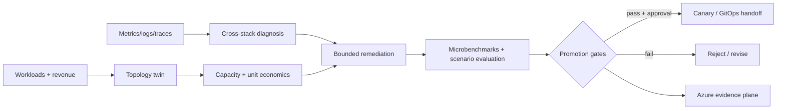
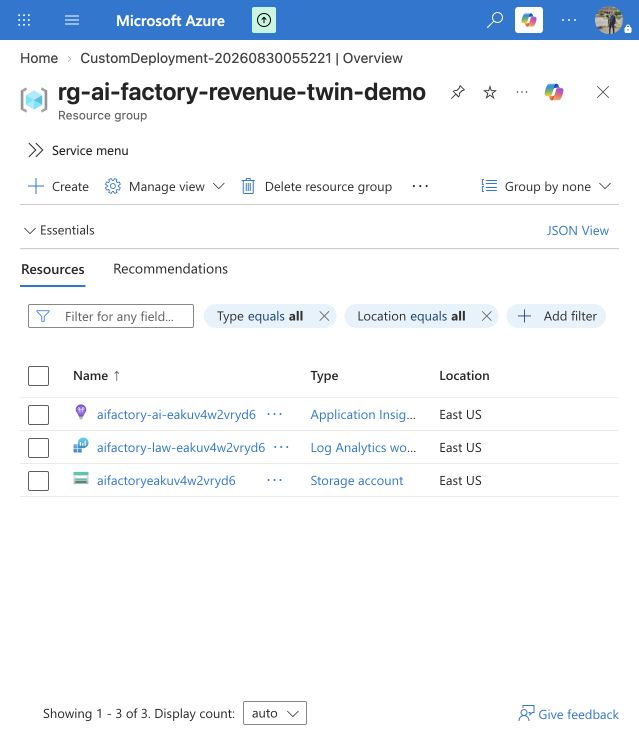

# Agentic AI Factory Revenue & Reliability Twin

**Convert AI-factory workload demand, topology and cross-stack telemetry into a measurable architecture decision, capacity economics, bounded remediation and production-readiness receipt.**

This project connects agentic AI, GPU infrastructure, high-performance networking, observability, cloud architecture, cybersecurity and IaC-to-compliance evidence without claiming access to hardware that was not used.

> Hardware-independent lane: the current demonstration uses deterministic synthetic DCGM/NCCL/NVLink/InfiniBand/RoCE/NIM-shaped fixtures. NVIDIA collectors and model providers are contracts until an authorized partner run produces retained evidence.



## Working vertical slice

- validates a 256-GPU commercial AI-factory intent;
- compares Ethernet, RoCE and InfiniBand reference topologies;
- diagnoses NCCL regression, PFC/ECN congestion, storage starvation, NVLink degradation and GPU XID errors;
- calculates GPU capacity cost, fabric cost, contribution margin, cost per useful GPU-hour and capacity-deferral value;
- routes bounded telemetry work to a Nemotron/NIM contract, ambiguous diagnosis to a frontier-model contract, repository work to a Codex-class contract and promotion authority to deterministic code;
- emits a bounded remediation with blast radius, required scenarios and rollback;
- prohibits autonomous production execution;
- defines partner receipts for DCGM, NCCL, NVLink, InfiniBand, RoCE and NIM metrics;
- includes a Bicep Azure evidence plane;
- runs with no third-party Python dependencies.

## Run

```bash
PYTHONPATH=src python3 -m aifactory.cli examples/256-gpu-factory.json --output generated/256-gpu-factory
PYTHONPATH=src python3 -m unittest discover -s tests -v
```

## Reference economics

The example uses configurable assumptions: 256 GPUs at $3.50/GPU-hour, 55% useful utilization and a 70% target. The gap represents 38.4 GPU equivalents and $98,112/month of modeled capacity-deferral value. That is not automatically cash savings; it can mean deferred purchases or additional sellable capacity.

## Claim boundary

- No DCGM collector or NVIDIA GPU was run.
- No NCCL, NVLink, InfiniBand or RoCE measurement is claimed.
- No NIM/Nemotron provider call is claimed.
- No production cluster modification is permitted.
- All cost values are reference scenario inputs, not quotations.
- Hardware and partner claims require signed, versioned execution receipts.

See the [search-term evidence map](docs/search-term-evidence.md) and
[partner validation ladder](docs/partner-validation.md).

## Azure deployment evidence

The lightweight evidence plane was deployed successfully on 30 August 2026 to
`rg-ai-factory-revenue-twin-demo` in East US. The public evidence intentionally
omits tenant, subscription and deployment-correlation identifiers.

Provisioned resources:

- Application Insights: `aifactory-ai-eakuv4w2vryd6`
- Log Analytics workspace: `aifactory-law-eakuv4w2vryd6`
- Storage account and private receipt container: `aifactoryeakuv4w2vryd6`



## Roadmap

1. Topology schema and interactive graph.
2. Prometheus/OpenTelemetry replay ingestion.
3. Mock DCGM and fabric exporters.
4. Evaluation scorecard across NIM/Nemotron, frontier providers and deterministic baselines.
5. Kubernetes and Slurm scheduling scenarios.
6. Confidential-computing attestation and KMS contract.
7. Azure/AWS/GCP/on-prem deployment modules.
8. Partner-executed collector and benchmark receipt.

## Work with A2Z SOC

Need to turn expensive GPU capacity into a measurable, reliable commercial AI service? **[Request an AI-factory architecture and unit-economics benchmark](https://a2zsoc.com).**
